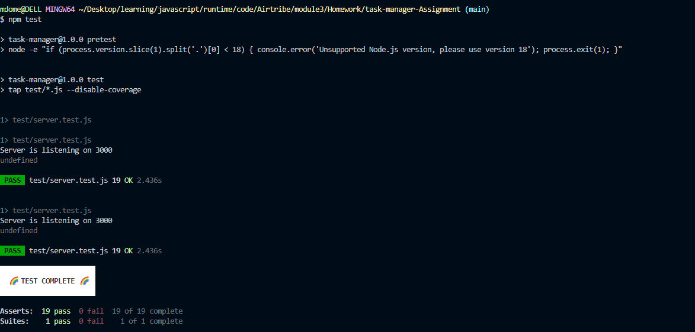

Task Manager API:

This is a RESTful API for a simple task manager application. It allows users to perform CRUD operations on tasks, including creating, reading, updating, and deleting tasks.

Setup
Clone the repository:

git clone https://github.com/your-username/task-manager.git
Install dependencies:

cd task-manager

npm install

Start the server:
npm start

API Endpoints:
GET /tasks: Retrieve all tasks.
GET /tasks/:id: Retrieve a task by ID.
POST /tasks: Create a new task.
PUT /tasks/:id: Update a task by ID.
DELETE /tasks/:id: Delete a task by ID.
GET /tasks/priority/:level: Retrieve tasks by priority level.

Usage
You can test the API using Postman or Curl. Here are some example requests:

Get all tasks:
curl http://localhost:3000/tasks

Create a new task:
curl -X POST http://localhost:3000/tasks -H "Content-Type: application/json" -d "{\"title\":\"New Task\",\"description\":\"Description of the new task\",\"completed\":false}"

Update a task:
curl -X PUT http://localhost:3000/tasks/1 -H "Content-Type: application/json" -d "{\"title\":\"Updated Task\",\"description\":\"Updated description\",\"completed\":true}"

Delete a task:
curl -X DELETE http://localhost:3000/tasks/1

Testing:
npm test

