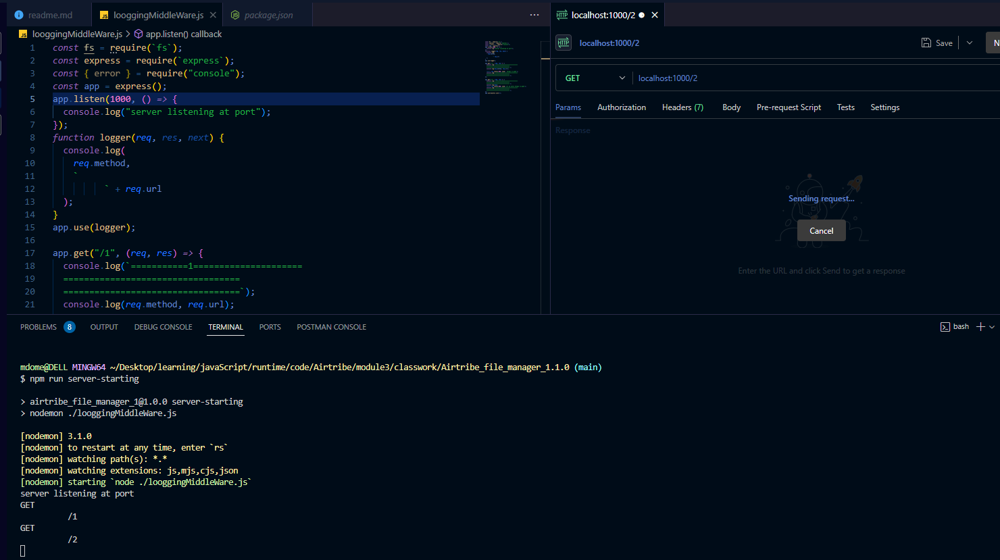

/*app.get("/1", (req, res) => {
  console.log(`===========1=====================
  ==================================
  ==================================`);
console.log(req.method,req.url);

  return res.status(500).send(` things is good`);
  console.log(`===========1=====================
  ==================================
  ==================================`);
});

app.get("/2", (req, res) => {
  console.log(`===========2=====================
  ==================================
  ==================================`);
  console.log(req.method,req.url);
  return res.status(500).send(` things is good`);
  console.log(`===========2=====================
  ==================================
  ==================================`);
});*/
in the both the codes we looging into the code we repeating its l5 l6 which does not make any seance so we will be designing a function for looger function which will take three param function req ,res, next=here next helping us after completeing the req its should be moveing to next other wise  our hung()

/*const fs = require(`fs`);
const express = require(`express`);
const { error } = require("console");
const app = express();
app.listen(1000, () => {
  console.log("server listening at port");
});
function logger(req, res, next) {
  console.log(
    req.method,
    `
          ` + req.url
  );
}
app.use(logger);

app.get("/1", (req, res) => {
  console.log(`===========1=====================
  ==================================
  ==================================`);
  console.log(req.method, req.url);

  return res.status(500).send(` things is good`);
  console.log(`===========1=====================
  ==================================
  ==================================`);
});

app.get("/2", (req, res) => {
  console.log(`===========2=====================
  ==================================
  ==================================`);
  console.log(req);
  return res.status(500).send(`its ok every things is good`);
  console.log(`===========2=====================
  ==================================
  ==================================`);
});
app.use(express.json());
});*/
res: